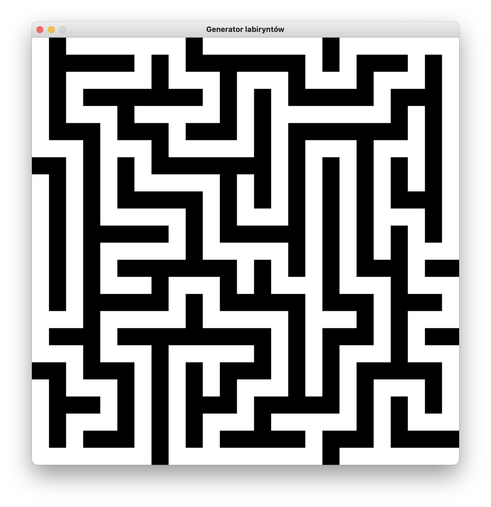
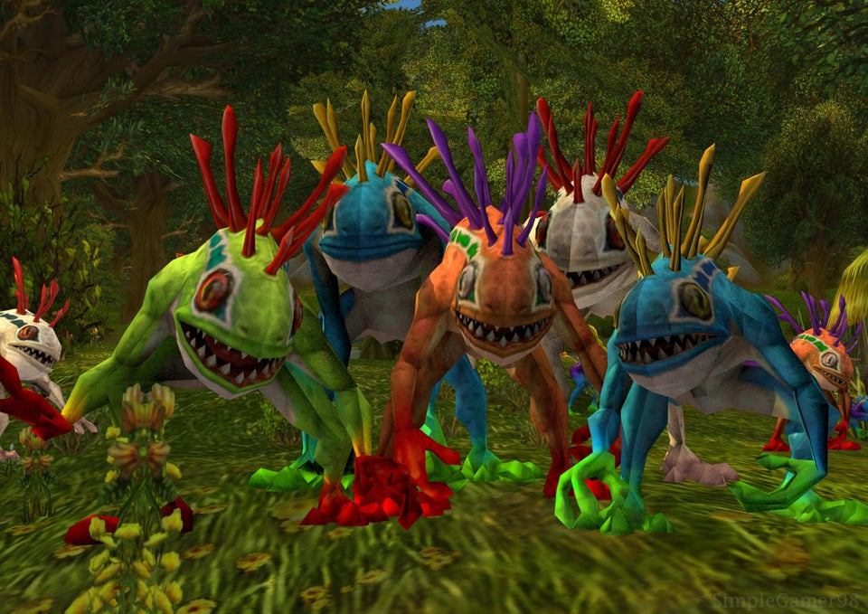

### PROJECT LABIRYNTH

Recently I finished a project for Tools in Computer Science classes. Together with my  with my colleagues we created **Project Labyrinth**.
Our programme **generates mazes** using many different algorithms. We used Python to code it and libaries such as tkinter and pygame. We have learned how to use many IT tools and improved our teamwork skills.

*An example of maze that our algorithm generates.*

For more details check out [documentation](https://github.com/AGH-Narzedzia-Informatyczne/Project_Labyrinth/wiki/1.-LABIRYNTY) of our project.

### MURLOCS

### About murlocs
* They live in World of Warcraft and also appear in Hearthstone card game
* One murloc won't hurt You. >10 of them will...
* They do funny noises kek

